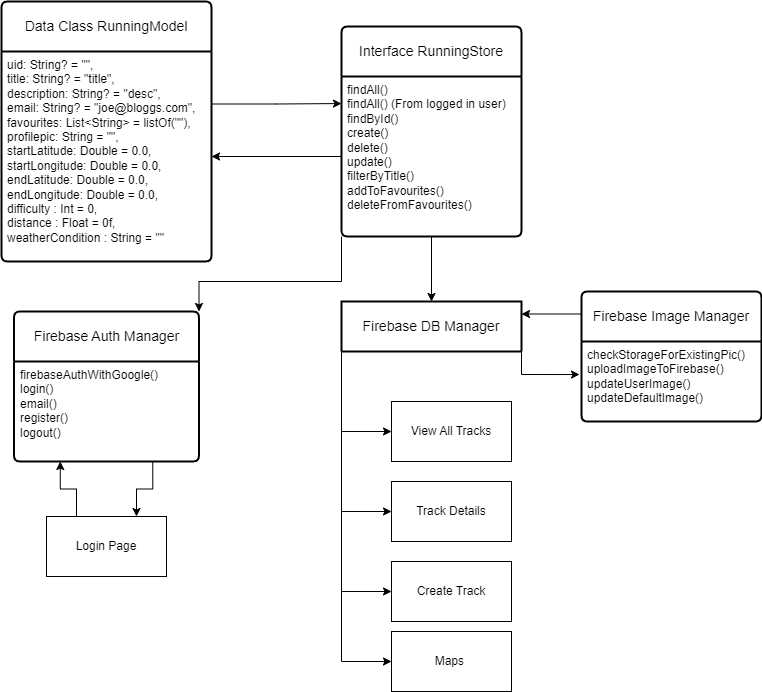

# Mobile App 2 CA 2 Technical Report

This README.md file acts as the technical report for this project. 

## Personal Statement

I declare that the code presented is my own, unless explicitly referenced or attributed to other sources.

I understand that SETU has a plagiarism policy which can lead to expulsion of students.
As such, I take full responsibility for the originality and authenticity of this project.
Dominik Kawka (20093701)

## Functionality

- User functionality: Creating and logging into an account.
- Google User Integration
- Create, View, Edit and Delete your tracks, managed via firebase
- Adding tracks to favourite
- Uploading/ changing profile picture to user
- View other users' submitted tracks 
- Filter through various tracks via search bar option
- Pinpoint tracks starting/ending point via google maps, including filters
- Option to choose between Light and Dark mode
- Swipe support; swipe down to refresh list, left/right for editing/deleting
- Navigation Architecture Components + Model,View,ViewModel Architecture Pattern

## External Libraries Used

- Firebase Auth + DB + Storage: Managing users, storing tracks,favourites and profile pictures
- Google Maps: Displaying user tracks on maps via pinpoints.
- Picasso: Image Handling
- Retrofit2: Creating custom API Model
- Timber: Used for logging/debugging

## UML + Classes Diagrams

## Firebase

- `tracks`: All Tracks
- `user-tracks`: Tracks belonging to specific users
- `favourites`: stores ID of track, and the ID of the user

## UX / DX Approach

I followed the Android Material Design as a guideline for the User Experience and Design. 

## Git Approach

Git workflow involved merging changes into a develop branch, which then flowed into a release branch, before finally integrating into the main branch. The release branch is used to create tagged releases. 

## References
- Labeled Returns: [Return @onClickListener](https://stackoverflow.com/questions/68453505/android-kotlin-what-does-returnonclicklistener-does)
- Scrollable Overlay on Maps: [Overlay on Google Maps](https://stackoverflow.com/questions/39721708/make-layout-that-overlay-above-google-map-fragment-in-android)
- Mobile App Labs were used as a base for this project. 
